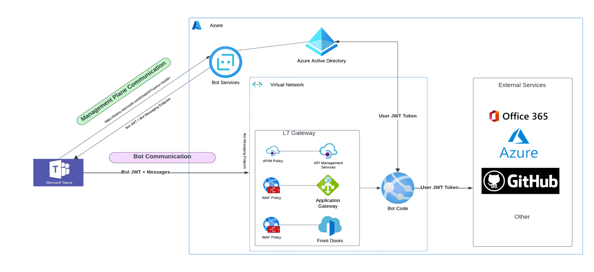

# Contributors

@sethsteenken 
@arekbar
@sbanjanovic

# Enterprise Security for Teams and Bot Framework Integration

Enterprise organizations today surface innovation with OpenAI-powered Azure Bot Framework and Microsoft Teams. Azure Bot Services provide a multi-channel, multi-language interface that seamlessly connects Azure Bot Framework Bots with Microsoft Teams.

A company's Teams tenant can quickly connect to their own bot application built on the [Bot Framework](https://learn.microsoft.com/en-us/azure/bot-service/bot-service-overview?view=azure-bot-service-4.0) to provide communication channels between their employees and Cognitive Services. This integration allows for common language queries against the company's internal data to quickly deliver insight and data in a semantic way.

Enterprise organizations also have a strong obligation to provide this functionality over strict security requirements in order to protect their employees and data. Understanding the purpose and interaction between services that make up this common pattern is critical to establishing a secure baseline for bot deployments.

[Documentation on securing a Microsoft Teams channel bot](https://learn.microsoft.com/en-us/azure/architecture/example-scenario/teams/securing-bot-teams-channel) is the recommended starting point for establishing a secure bot channel.


This article serves to provide further details and expand on the available security controls for this architecture to help provide the most secure communication channel between employees and the AI-assisted bot.

## Key Bot Components

### Azure Bot Service

The Azure Bot Service is an Azure managed service that provides bot channel registration and identity. External clients initiate a request to Azure Bot Service channels, providing a bot identifier. If a valid bot channel identifier is provided, Azure Bot Service returns a JWT token and a URL where your Bot Framework Bot can be reached. The external client then initiates a connection to the Azure Bot Framework Bot via the provided URL endpoint.


### Azure Bot Framework Bot

The Azure Bot Framework provides SDKs and GUI tools for creating intelligent bots. Bots can be deployed using services like Azure App Service. This is the actual location of all the bot logic.


## Proposed Network Security Explained

The recommended architecture provides a secure network path to keep a custom bot application isolated from the internet. Azure Firewall, Azure VNETs, DDoS protection keeps the custom bot application secure, protected, and isolated from direct access from the internet.

Microsoft Teams communicates over the public internet and should be considered as an external client. Microsoft Teams provides the [public IP address ranges](https://learn.microsoft.com/en-us/microsoft-365/enterprise/urls-and-ip-address-ranges?view=o365-worldwide#skype-for-business-online-and-microsoft-teams) that allow us to apply L4 controls at the ingress to our Bot Framework Bot.

To allow communication with a bot application, the bot must be registered with [Azure Bot Service](https://azure.microsoft.com/en-us/products/ai-services/ai-bot-service). This service allows for a [private endpoint](https://learn.microsoft.com/en-us/azure/bot-service/dl-network-isolation-concept?view=azure-bot-service-4.0#use-of-private-endpoints) to prevent public internet access to the service resource; however, enabling this feature will block Teams from interfacing with the Azure Bot Services resource. The Azure Bot Service must remain accessible publicly in order to allow external clients like Teams to establish a secure channel with your Bot Framework Bot.

## Improve Bot Communication Security

Additional security measures can be applied to the recommended architecture using Azure API Management (APIM) Policy or Azure Web Application Firewall (WAF) Policy. These security measures include:

1. APIM Policy or WAF Policy to authorize corporate Teams tenant.
2. Authorize user on bot application.



### Use APIM Policy or WAF Policy to Restrict Teams Traffic to Own Tenant

The Azure Firewall resource will provide the option for an IP whitelist to only allow traffic from Teams public IP addresses. This, however, will allow all Teams traffic including other organization's tenants. To block traffic from other tenants, a policy can be added to validate request headers for **x-ms-tenant-id** that Teams will include when communicating with the bot application. This tenant id is a unique identifier for an organization's Teams tenant. Verifying this tenant id will prevent other tenants from reaching the bot application but allow requests from the organization's Teams tenant.

#### Example Request Headers from Teams


#### WAF Policy

Azure Web Application Firewall allows for L7 traffic inspection. As Microsoft Teams initiates communication via the messaging endpoint, it sends the above mentioned **x-ms-tenant-id** header. This allows us to create a WAF policy that will inspect the header and only allow access from specified tenants. WAF policy can be applied regionally at the Azure Application Gateway Layer or globally in Azure Front Door.


#### APIM Policy

APIM Gateway also operates at layer 7, providing the option to define request handling rules in policy. The below policy inspects the **x-ms-tenant-id** header and compares it against an allow list. If the header does not match allowed tenant ids, the request will return a 401 unauthorized response, thus locking down bot communication to your tenant.

```xml
<set-variable name="isAllowedTenant" value="@(context.Request.Headers.GetValueOrDefault("x-ms-tenant-id","").Equals("<TEAMS TENANT ID HERE>"))"/>
    <choose>
        <when condition="@(context.Variables.GetValueOrDefault<bool>("isAllowedTenant"))">
            <!-- The request will proceed as normal -->
        </when>
        <otherwise>
            <return-response>
                <set-status code="401" reason="Unauthorized"/>
                <set-header name="WWW-Authenticate" exists-action="override">
                    <value>"The tenant ID is invalid"</value>
                </set-header>
            </return-response>
        </otherwise>
    </choose>
```

### Authorize User on Bot Application

TODO – need high level instructions + link(s)

TODO – include purple blob from arch?

Possible Links:

- WAF Custom Rules
  - [Azure Web Application Firewall (WAF) v2 custom rules on Application Gateway | Microsoft Learn](https://learn.microsoft.com/en-us/azure/web-application-firewall/ag/custom-waf-rules-overview)
- APIM Policy
  - [Policies in Azure API Management | Microsoft Learn](https://learn.microsoft.com/en-us/azure/api-management/api-management-howto-policies)
  - [Azure API Management policy reference | Microsoft Learn](https://learn.microsoft.com/en-us/azure/api-management/api-management-policies)


## Closing

Integrating an organization's Teams channels with an AI-assisted bot can improve efficiency and problem-solving for its employees. Securing and protecting that communication is most important for enterprise organizations. While Teams operates on the public internet, the measures outlined above will provide a secure communication from Teams into an organization's private cloud network.

